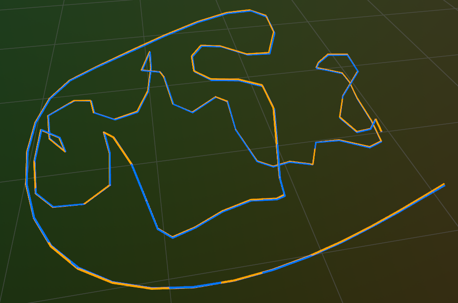

# Feature-based RGB-D SLAM

RGB-D feature-based visual SLAM system in C++. Uses ORB features to track frames against the local map, refines poses and landmarks via local BA, and exploits pose-graph optimization for global consistency.

<p align="center">
  
  <br>
  <em><span style="color:orange">GT</span> vs <span style="color:#0078FF">Estimated</span> pose on Replica dataset</em>
</p>

1. **Tracking Against Local Map** -- Estimate each frame's pose by matching against local map points. Uses a constant velocity model for feature association search, P3P + RANSAC for an initial pose estimate, and Motion-BA for pose refinement. The local map is defined as the set of covisible keyframes of the current keyframe.

2. **Local Mapping** -- On new keyframes: associate observations with tracked map points, create new map points by backprojecting unmatched keypoints, update the covisibility graph, and cull low-quality points based on observation count.

3. **Local Bundle Adjustment** -- Jointly optimizes the current keyframe, its covisible keyframes, and their map points using factor graph optimization with Huber-robust projection factors and depth priors. Keyframes not covisible with the current keyframe are held fixed.

4. **Pose Graph Optimization (TODO)** -- Loop closure detection and global pose graph optimization.

## Approach

```
                                                                  +--------------------+
                                                                  |     New Frame      |
                                                                  |  (RGB-D + ORB)     |
                                                                  +---------+----------+
                                                                            |
                                                                            v
                                                            +------------------------------+
                                                            | 1. TRACKING AGAINST          |
                                                            |    LOCAL MAP                 |
                                                            |------------------------------|
                                                            | Constant velocity prediction |
                                                            |             |                |
                                                            |             v                |
                                                            |   Match last-KF map points   |
                                                            | (project + descriptor match) |
                                                            |             |                |
                                                            |             v                |
                                                            |  AP3P + RANSAC -> Motion-BA  |
                                                            |             |                |
                                                            |             v                |
                                                            | Match local-map map points   |
                                                            |      (covisibility graph)    |
                                                            |             |                |
                                                            |             v                |
                                                            |       Final Motion-BA        |
                                                            +-------------+----------------+
                                                                          |
                                                                    New keyframe?
                                                                    /             \
                                                                  No                 Yes
                                                                  |                   |
                                                                  v                   v
                                                            Next frame   +-------------------------+
                                                                          |    2. LOCAL MAPPING     |
                                                                          |-------------------------|
                                                                          |   tracked map points    |
                                                                          | observation association |
                                                                          |           |             |
                                                                          |           v             |
                                                                          | new map points creation |
                                                                          |           |             |
                                                                          |           v             |
                                                                          |   covisibility graph    |
                                                                          |        update           |
                                                                          |           |             |
                                                                          |           v             |
                                                                          |    map points culling   |
                                                                          +-----------+-------------+
                                                                                      |
                                                                                      v
                                                                          +----------------------+
                                                                          | 3. LOCAL BA          |
                                                                          |----------------------|
                                                                          | Factor graph:        |
                                                                          | covisible KFs        |
                                                                          | + points             | 
                                                                          | + fixed neighbors    |
                                                                          |          |           |
                                                                          |          v           |
                                                                          | Levenberg-Marquardt  |
                                                                          | optimization         |
                                                                          +-----------+----------+
                                                                                      |
                                                                                      v
                                                                          +---------------------+
                                                                          | 4. PGO (TODO)       |
                                                                          |---------------------|
                                                                          | Loop closure +      |
                                                                          | global pose graph   |
                                                                          +---------------------+
```


## Dependencies

| Library | Version | Purpose |
|---------|---------|---------|
| **OpenCV** | 4.x | ORB features, image I/O, PnP solver |
| **Eigen3** | 3.x | Linear algebra |
| **Sophus** | 1.22.10 | SE(3) Lie group representations (fetched by CMake) |
| **GTSAM** | 4.2 | Factor graph optimization (fetched by CMake) |
| **Rerun** | latest | 3D visualization (fetched by CMake) |

Sophus, GTSAM, and Rerun are automatically downloaded via CMake `FetchContent`. You only need OpenCV and Eigen3 installed on your system.

### Install system dependencies (Ubuntu/Debian)

```bash
sudo apt update
sudo apt install -y cmake g++ libopencv-dev libeigen3-dev
```

## Build

```bash
mkdir build && cd build
cmake ..
make -j2
```

## Usage

```bash
./fslam <dataset_type> <base_path> <sequence> [local_ba]
```

| Argument | Description | Default |
|----------|-------------|---------|
| `dataset_type` | `tum` or `replica` | `tum` |
| `base_path` | Path to dataset root | (see Config.hpp) |
| `sequence` | Sequence name | `fr3_long_office_household` |
| `local_ba` | Enable local BA: `1` or `0` | `1` (enabled) |

**Examples:**

```bash
# TUM RGB-D
./fslam tum /path/to/TUM fr3_long_office_household 1

# Replica
./fslam replica /path/to/Replica office0 1
```
